图1 下行传输媒体包的排队网络模型

​	初始时刻，有限个媒体包$N$从外部到达了media server（M1），经过lastmile传输（M2）后能被用户接收到（M4），传输存在弱网因素引起了丢包，抽象意义上进入了lost packet list（M3）。用户在timeout时间内未收到的媒体包，向media server发起重传请求，历史的所有重传请求由M5记录。直到尽可能多的媒体包到达用户端时，用户可解码播放。建立这个模型以分析和控制总的传输耗时。

​	除了弱网引起的丢包（link loss)，在经过中间各个路由节点时，队列深度的限制下buffer已满，后续到达的媒体包直接被丢弃，这种丢包标记为（overflow loss）。弱网丢包率记作$P_{2,3}$。

​	设在各个节点$M_i$的排队时间$r_i(t)$，中间每一段的传输时间为$\tau_{i,j}$，各个节点的排队长度和队列深度记作$X_i(t)$和$s_i$，发送包的速率为$\mu_i$（单位：包数/秒）。

​	重传请求的定时器间隔$\epsilon$，单次重传RTT记作$z(t)$，（以下逻辑与sdk不完全一致），retransmission timeout $\approx z(t)$，检查$[t-z-\epsilon, t-z]$这段时间未接收到的媒体包并发起重传请求。

​	公式1 单次重传RTT的代数方程
$$
z(t)=\tau_{31} + r_1(t-\tau_{24}-r_2(t-\tau_{24})-\tau_{12}) + \tau_{12} + r_2(t-\tau_{24}) + \tau_{24}
$$
​	公式2 排队时延的代数方程
$$
r_1(t) = \frac{1}{\mu_1} \cdot X_1( t-r_1(t)) \\
r_2(t) = \frac{1}{\mu_2} \cdot X_2( t-r_2(t))
$$
​	公式3 排队网络各个节点状态的Jump Vectors
$$
h^{(12)}=(- 1,+ 1,  0,  0,  0) \\
h^{(13)}=(- 1,  0,+ 1,  0,  0) \\
h^{(24)}=(  0,- 1,  0,+ 1,  0) \\
h^{(23)}=(  0,- 1,+ 1,  0,  0) \\
h^{(31)}=(+ 1,  0,  0,  0,  0) \\
h^{(35)}=(  0,  0,  0,  0,+ 1) \\

\mathbf{X}+h^{(ij)}=\displaystyle(\dots, X_i-1, \dots, X_j+1, \dots)
$$
​	公式4 排队网络的状态转移速率
$$
\begin{align*}
q(\mathbf{X}, \mathbf{X}+h^{(35)}) &= \frac{1}{\epsilon} \cdot \max \{0, X_3(t-z(t)) - X_3(t-z(t-\epsilon)-\epsilon)\} \\
q(\mathbf{X}, \mathbf{X}+h^{(31)}) &= q(\mathbf{X}, \mathbf{X}+h^{(35)}) \\
q(\mathbf{X}, \mathbf{X}+h^{(13)}) &= q(\mathbf{X}, \mathbf{X}+h^{(31)}) \cdot P\{X_1 \geq s_1\} \\
q(\mathbf{X}, \mathbf{X}+h^{(12)}) &= \mu_1 \cdot P\{X_1 > 0\} \\
q(\mathbf{X}, \mathbf{X}+h^{(23)}) &= \mu_1 \cdot P\{X_1 > 0\} \cdot P\{X_2 \geq s_2\} + \mu_2 \cdot P\{X_2 > 0\} \cdot P_{2,3} \\
q(\mathbf{X}, \mathbf{X}+h^{(23)}) &= \mu_2 \cdot P\{X_2 > 0\} \cdot (1-P_{2,3}) \\
\end{align*}
$$
​	公式5 微分近似模型
$$
\frac{\partial X_i(t)}{\partial t} = \displaystyle
\sum_{k \neq i} q(\mathbf{X}, \mathbf{X}+h^{(ki)}) + \sum_{i \neq k} (-1) \cdot q(\mathbf{X}, \mathbf{X}+h^{(ik)})
$$
​	公式6  初值条件
$$
\begin{align*}
X_1(0) &= N \\
X_i(0) &= 0, \quad i \neq 1 \\
r_i(0) &= 0, \quad i=1,2 \\
z(0) &= \tau_{31}+\tau_{12}+\tau_{24}
\end{align*}
$$
​	公式7 $K$次重传总共发送重传包个数
$$
\begin{align}
\max X_5 &= G_{rexfer}(N, P_{loss}) \\
&= \frac{P_{loss} \cdot (1-P_{loss}^{K})}{1-P_{loss}} \cdot N
\end{align}
$$
